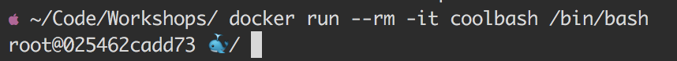

# Coolbash

Get a cool bash prompt in your docker container. Simple `.bashrc` file added to get emoji at the commandline. 




## Pull

Get it from docker hub

```bash
docker pull dischord01/coolbash
```


## Build

Build it your self

```
git clone https://github.com/dischord01/coolbash.git 
cd coolbash
docker build -t coolbash .
```